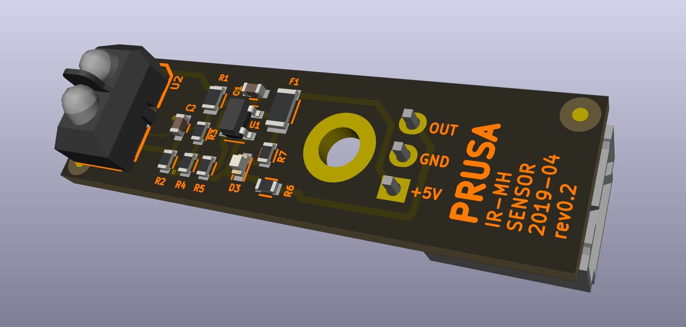

# PRUSA IR-MH sensor board

KiCad PCB layout

* [Interactive bom](http://htmlpreview.github.io/?https://github.com/prusa3d/IR-MH-sensor-PCB/blob/master/rev.02/ibom.html)
* [STEP 3D model](rev.02/IR-MH-sensor-02.step)
